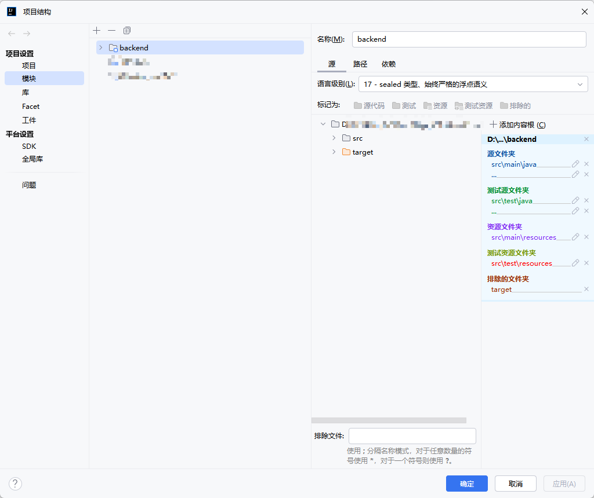
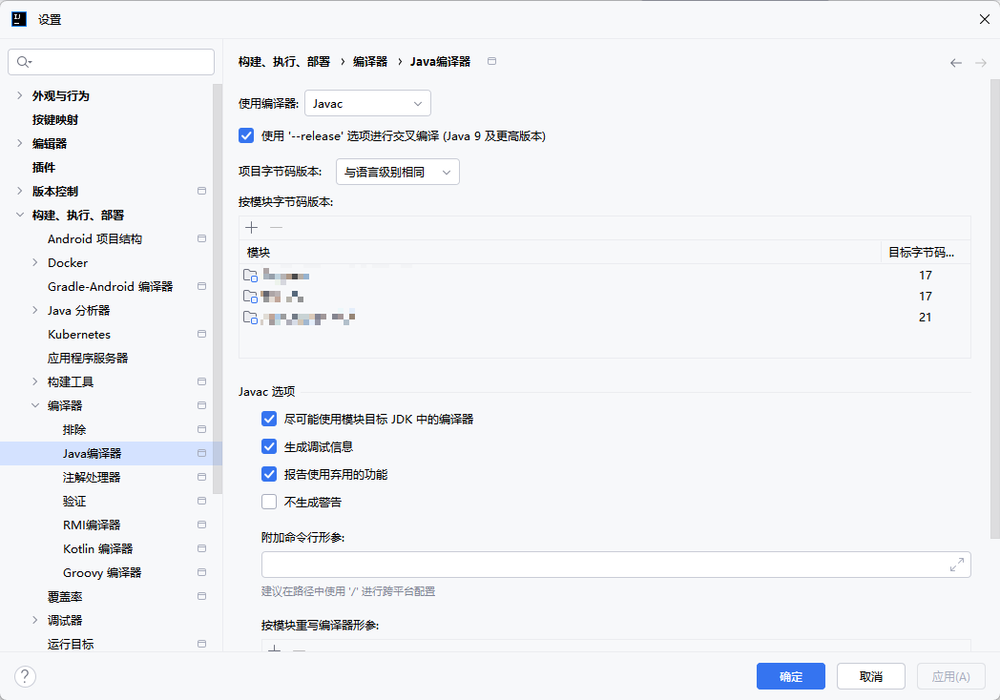

## 背景

JDK升级不仅带来了性能提升，还有许多的新特性和新方法。在开发新项目使用JDK 21的过程中，编译时报错`找不到符号`。

## 解决方法

查看项目设置，发现项目自动设置成了JDK 17，尽管此时选择的是JDK 21。



查看编译器设置，也设置成了JDK 17，所以导致编译报错。



已经设置了`maven.compiler.source`为21，还是不行。

```xml
<properties>
    <maven.compiler.source>21</maven.compiler.source>
    <maven.compiler.target>21</maven.compiler.target>
    <project.build.sourceEncoding>UTF-8</project.build.sourceEncoding>
</properties>
```

手动修改是不行的，一旦刷新maven依赖，还是会变成JDK 17。

具体解决方法是：

使用`maven-compiler-plugin`插件，设置release为21。

如果是SpringBoot项目，会自带这个插件，也可以自己添加这个插件。

```xml
<build>
    <plugins>
        <plugin>
            <groupId>org.apache.maven.plugins</groupId>
            <artifactId>maven-compiler-plugin</artifactId>
            <configuration>
                <release>21</release>
            </configuration>
        </plugin>
    </plugins>
</build>
```

之后再刷新maven，就自动变更成了JDK 21。
